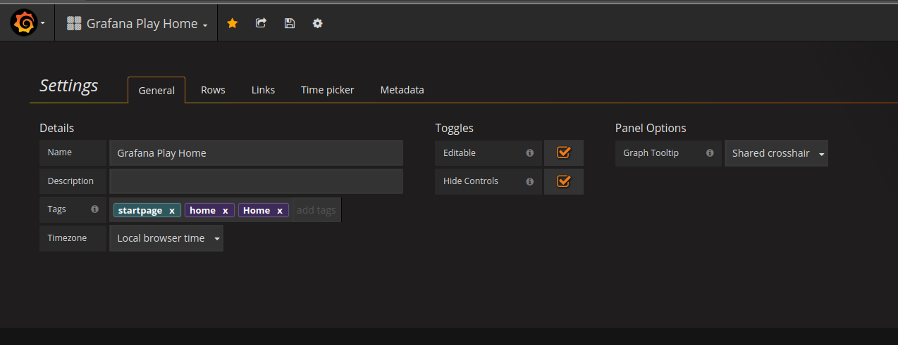

# Grafana
1. **Display the cursor on multiple graphs at once**
  * In dashboard settings you have a dashboard wide graph tooltip option (can be cycled using keyboard shortcut as well). Shared crosshair will show a line over all graphs when you hover over any graph, shared tooltip will show tooltip as well on all graphs.

